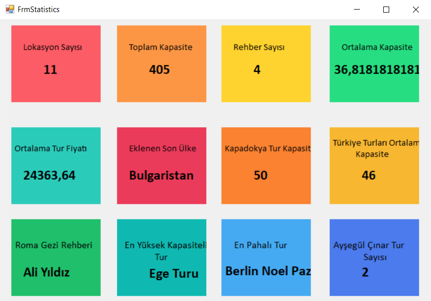

# 🚀 CSharpEgitimKampi301

Bu repo, **C# Eğitim Kampı** çerçevesinde gerçekleştirilen projeyi içermektedir.  
📌 Projede **Entity Framework** kullanılarak **veritabanı işlemleri** gerçekleştirilmiş  
🔍 **LINQ sorguları** ile veriler dinamik olarak işlenmiştir.  
🛠 **Katmanlı mimari** prensipleri benimsenerek, **Windows Forms** arayüzüyle entegre bir yapı oluşturulmuştur.  

## 📸 Proje Ekran Görüntüsü

Aşağıda, proje kapsamında geliştirilen **FrmStatistics** arayüzüne ait bir ekran görüntüsü bulunmaktadır:

